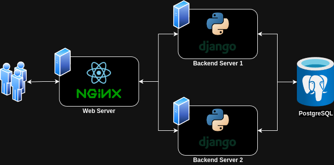

# Named Entity Recognition (NER) Web Application

## Architecture

  

## Deploying NER-Webapp on your host
1. Clone this repository, change directory and open terminal
2. Run `docker compose up` in the terminal
3. Open `http://localhost` in your browser

## Getting started for development
- TODO
