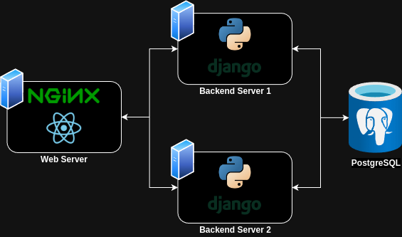

# Named Entity Recognition (NER) Web Application

## Deploying NER-Webapp on your host
1. Clone this repository and change directory
2. Run `docker compose up` in your terminal
3. Open browser and open `http://localhost`

## Getting started for development
- TODO
